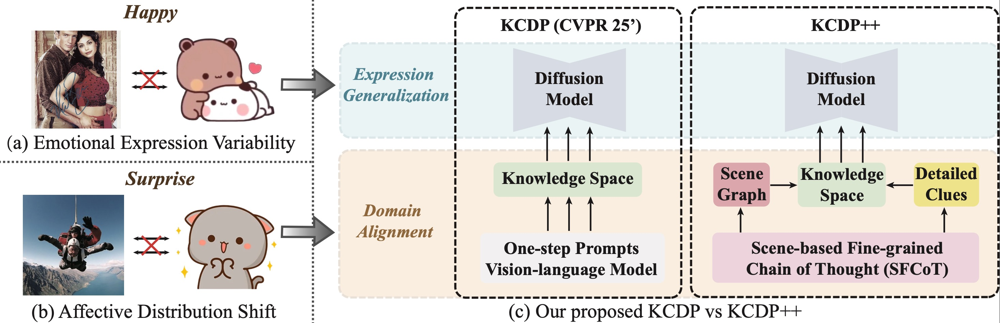
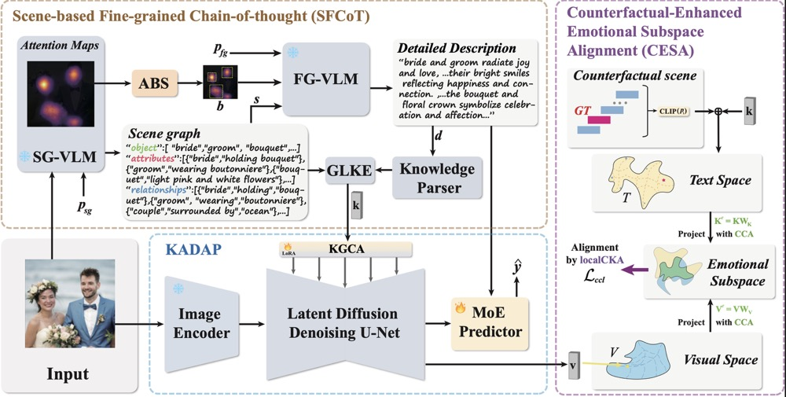

# KCDP 

[Wen Yin](https://yinwen2019.github.io), Yong Wang, [Guiduo Duan](https://www.scse.uestc.edu.cn/info/1081/11210.htm), [Dongyang Zhang](https://zhangdy827.github.io/dyzhang.github.io/), Xin Hu, [Yuan-Fang Li](https://liyuanfang.github.io), [Tao He](https://ht014.github.io/)*

CVPR 2025 paper: "Knowledge-Aligned Counterfactual-Enhancement Diffusion Perception for Unsupervised Cross-Domain Visual Emotion Recognition"

Expanded T-PAMI journal paper: "KCDP++: Improving Cross-Domain Emotion Recognition with Structured Knowledge-Aligned Counterfactual-Enhanced Diffusion Perception"
## New task 🆕
We introduce a new task *Unsupervised Cross-Domain Visual Emotion Recognition* (UCDVER): a model learns from labeled source data (e.g., realistic photos) and, optionally, unlabeled target data (e.g., stickers), and must recognize emotions in the target domain. 
Compared with classical cross-domain recognition in detection and classification, UCDVER confronts more severe semantic and stylistic gaps. 
There are two challenges:
- Emotional expression variability: Emotional expressions differ significantly across domains. Realistic images capture subtle, human emotions, while stickers tend to exaggerate or simplify emotions, often emphasizing sinular or multiple virtual elements.
- Affective distribution shift: According to the Emotional Causality theory, emotion arises from a sequence involving (i) external events, (ii) emotional states, and (iii) physiological responses. Stickers or emojis emphasize the last two, i.e. (ii) and (iii), while the emotions in realistic images  are often grounded in the external context surrounding the subject(s).



## Motivation 🚂
To tackle these issues, our CVPR work introduced the Knowledge-aligned Counterfactual-enhancement Diffusion Perception (KCDP) framework. 
KCDP maps affective cues into a domain-agnostic knowledge space and performs diffusion-based affective perception. 
Its Knowledge-Alignment Diffusion Affective Perception (KADAP) module uses BLIP to caption images, parses captions into knowledge triplets, and injects them via a knowledge-guided cross-attention mechanism trained with LoRA. For adaptation, KCDP further proposed Counterfactual-Enhanced Language–Image Emotional Alignment (CLIEA), which leverages a causal graph and multiple interventions for counterfactual contrastive learning.

While such single-step prompting suffices for coarse descriptions, emotion recognition demands deeper reasoning and finer cues. Recent chain-of-thought (CoT) techniques emphasizing global relations or fine-grained details suggest that structured, multi-step reasoning could yield more robust domain-agnostic signals. We propose KCDP++, an enhanced extension of KCDP that performs multi-step emotional reasoning and more efficient domain adaptation.

## Approach ☄️


KCDP++ introduces a Scene-based Fine-grained Chain of Thought (SFCoT) that jointly extracts a scene graph and detailed regional cues before aligning them in the knowledge space. 
SFCoT operates in two stages: (1) scene-graph generation via targeted prompts to capture global relations; (2) fine-grained reasoning guided by Attention-driven Box Selection, which identifies key local regions from the first-stage VLM’s feature maps for pivotal local analysis. 
To better condition diffusion-based perception, we design a Global–Local Knowledge Extraction (GLKE) strategy that transforms the SFCoT outputs into guidance for the latent diffusion model. Together, SFCoT and GLKE enable KCDP++ to leverage structured, multi-step reasoning for robust cross-domain emotion perception.

To further strengthen domain adaptation, we develop Counterfactual-Enhanced Emotional Subspace Alignment (CESA), an efficient alignment scheme. 
Rather than learning a high-dimensional MLP projection as CLIEA, CESA performs emotional subspace projection that couples Canonical Correlation Analysis (CCA) with CKA to identify and exploit subspaces capturing subtle but important shared affective semantics. 
Projecting text–image pairs into these subspaces improves alignment quality and yields higher-reliability pseudo-labels for unlabeled target data—while reducing joint-training overhead.

## Setup and Experiments 🧑‍🔧
### Environment Setup
We set up the environment by requirements.txt.
```
pip install -r requirements.txt
```
### Models Setup
Load Stable-diffusion

Download the checkpoint of [stable-diffusion](https://github.com/CompVis/stable-diffusion) (v1-5 by default) and put it in the folder ``weight/sd/``. Please also follow the instructions in stable-diffusion to install the required packages.

Load CLIP-text-Encoder

After setup stable diffusion, we download the checkpoint of [CLIP Text encoder](https://huggingface.co/openai/clip-vit-large-patch14-336/tree/main) and put it in the folder ``weight/sd/``. Then set the loading url of CLIP at the FrozenCLIPEmbedder Class in ``ldm/modules/encoders/modules.py```.
### Train stage
DA setting:
```
python train_da.py
```

UC setting:
```
python train.py
```
### Test stage
DA setting:
```
python test_da.py
```

UC setting:
```
python test.py
```

## Acknowledgements
This code is based on [VPD](https://github.com/wl-zhao/VPD), [TADP](https://github.com/damaggu/TADP), [stable-diffusion](https://github.com/CompVis/stable-diffusion),
## Citation
```
@article{ucdver,
  title={Knowledge-Aligned Counterfactual-Enhancement Diffusion Perception for Unsupervised Cross-Domain Visual Emotion Recognition},
  author={Wen Yin, Yong Wang, Guiduo Duan, Dongyang Zhang, Xin Hu, Yuan-Fang Li, Tao He},
  journal={CVPR},
  year={2025}
}
```
