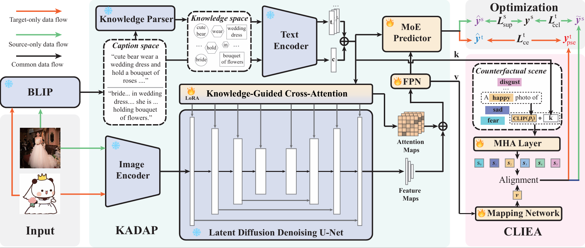

# KCDP

Code for paper "Knowledge-Aligned Counterfactual-Enhancement Diffusion Perception 
 for Unsupervised Cross-Domain Visual Emotion Recognition"
## Abstract
Visual Emotion Recognition (VER) is a critical yet challenging task aimed at inferring the emotional states of individuals based on visual cues. However, recent approaches predominantly focus on single domains, e.g., realistic images or stickers, limiting VER models' cross-domain generalizability. To address this limitation, we introduce an Unsupervised Cross-Domain Visual Emotion Recognition (UCDVER) task, which aims to generalize visual emotion recognition from the source domain (e.g., realistic images) to the low-resource target domain (e.g., stickers) in an unsupervised manner. Compared to the conventional unsupervised domain adaptation problems, UCDVER presents two key challenges: a significant emotional expression variability and an affective distribution shift. To mitigate these issues, we propose the  Knowledge-aligned Counterfactual-enhancement Diffusion Perception (KCDP) framework for UCDVER. Specifically, KCDP first leverages a vision-language model to align emotional representations in a shared knowledge space and guides diffusion models for improved visual affective perception. Furthermore, a Counterfactual-Enhanced Language-image Emotional Alignment (CLIEA) method generates high-quality pseudo-labels for the target domain. Extensive experiments demonstrate that our approach surpasses state-of-the-art models in both perceptibility and generalization, e.g., gaining $12$\% improvements over SOTA VER model TGCA-PVT.

## Approach



### Train stage
Example:

DA setting:
Run the script ```python train_da.py```

UC setting:
Run the script ```python train.py```